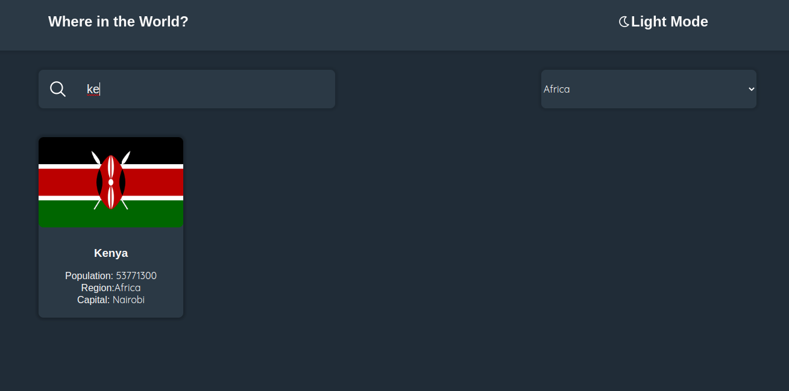
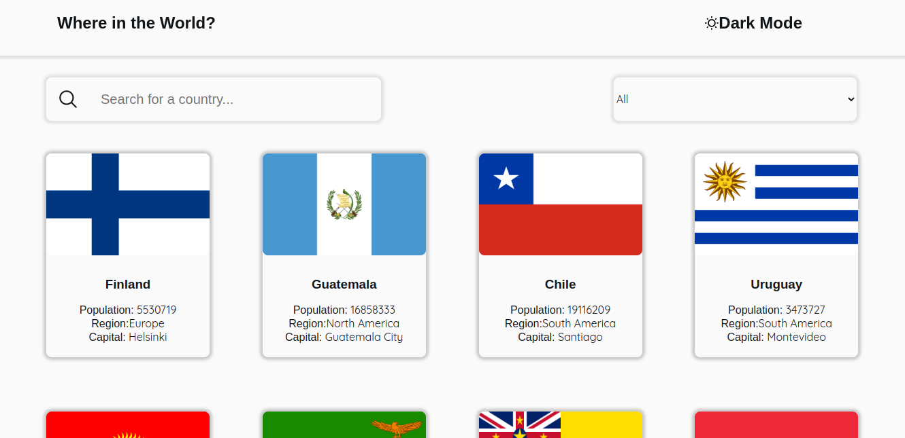

# Frontend Mentor REST Countries API with color theme switcher solution

    This is my solution to the 
    <a href ="https://www.frontendmentor.io/challenges/  rest-countries-api-with-color-theme-switcher-5cacc469fec04111f7b848ca">
        Frontend Mentor countries API challenge
    </a> 

<h2>Table ofContents</h2>
<ul>
    <li><a href ="#overview">Overview</a>
        <ul>
            <li><a href="#challenge">The Challenge</a></li>
            <li><a href="#screenshot">Screenshots</a></li>
            <li><a href="#site">Live site</a></li>
        </ul>
    </li>
    <li><a href="#process">My Process</a>
        <ul>
            <li><a href="#tools">Tools used</a></li>
            <li><a href="#challenges">Challenges</a></li>
            <li><a href="#resources">Useful Resources</a></li>
        </ul>
    </li>
    <li><a href="#local">Run on your machine</a></li>
    <li><a href="#author">Author</a></li>
</ul>
<h2 id="overview">Overview</h2>
<h3 id="challenge">The Challenge</h3>

    Your challenge is integrating with the <a href ="https://restcountries.com/">REST Countries API</a> to pull country data and display it to the user.

You can use any JavaScript framework/library on the front-end, such as <a href="https://reactjs.org" target="_blank">React</a> or <a href="https://vuejs.org" target="_blank">Vue</a>. You also have complete control over which packages you use to make HTTP requests or style your project.

Your users should be able to:

<ul>
    <li>See all countries from the API on the homepage</li>
    <li>Search for a country using an <code>input</code> field</li>
    <li>Filter countries by region</li>
    <li>Click on a country to see more detailed information on a separate page</li>
    <li>Click through to the border countries on the detail page</li>
    <li>Toggle the color scheme between light and dark mode <em>(optional)</em></li>
</ul>
<h3 id ="screenshot">Screenshots</h3>
</img>
</img>
<h3 id="site">Live Site</h3>

    The site is deployed using github pages
    <a href ="https://kiprop-dave.github.io/countries-api/">here</a> 

<h2 id="process">My Process</h2>
<h3 id="tools">Tools used 🔧</h3>
<ul>
    <li>React</li>
    <li>CSS flexbox</li>
    <li>CSS grid</li>
    <li>Axios</li>
    <li>React Router</li>
</ul>

This app uses the React library. I used funtional components with hooks. I used the context api for state management. It uses React Router to render the different pages. It uses Axios to fetch data from the REST countries api.

<h3 id="challenges">Challenges</h3>

1. Using React Router for rendering different pages came with a problem I am yet to fix. Refreshing the country details page breaks the app.
2. Some countries come with insufficient data that it breaks the app. For instance trying to see the details of <code>Macau </code>will break the App. I am still looking for a solution for this.

<h3 id="resources">Useful Resources</h3>
<ul>
    <li>
        <a href="https://stackoverflow.com/">Stack Overflow</a>
        - Whenever I got stuck, I would check stack overflow for some insight.
    </li>
    <li>
        <a href="https://developer.mozilla.org/en-US/">MDN web docs</a>
        - In case I forgot some syntax, I would always refer to the docs.
    </li>
    <li>
        <a href="https://scrimba.com/">Scrimba</a>
        - This is the best place to learn frontend development in my opinion.
    </li>
</ul>

<h2 id ="local">Run on your machine</h2>
In order for you to run this app on your localhost, you must have node installed on your system. You can get Node <a href="https://nodejs.org/en/">here</a>.
If you already have node installed, clone the development branch of this repo.

`git clone -b development --single-branch https://github.com/kiprop-dave/countries-api.git`

Then run

`npm install`

to install dependencies. Finally run

`npm run dev`

and open the link on your browser.

<h2 id="author">Author</h2>
<ul>
    <li>
        LinkedIn - 
        <a href="https://www.linkedin.com/in/david-tanui-671b08231/">David Tanui</a>
    </li>
    <li>
        Frontend Mentor -
        <a href="https://www.frontendmentor.io/profile/kiprop-dave">Kiprop Dave</a>
    </li>
</ul>
